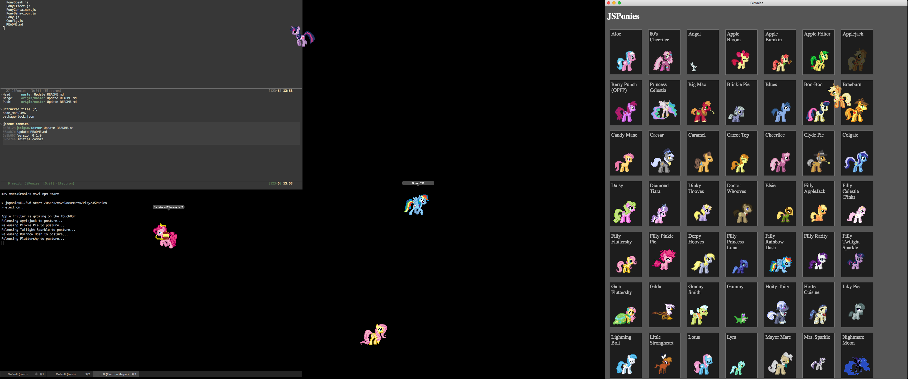

# JSPonies
Desktop Ponies in Javascript / Node.js / Electron

(very nearly) based on the original [Desktop Ponies](https://github.com/RoosterDragon/Desktop-Ponies).

# Background
"Let's make the TouchBar do something useful", I thought. "Let's make it display PONIES! Because PONIES!".

After all of five minutes of browsing (which I can't reproduce now; otherwise I would give credit where due) I stumbled upon a Java implementation of Desktop Ponies, **JPonies**, which I could run on my machine. That's when a tiny horse-sized hole opened up in front of me and I realised that my OCD would never allow me to let this go unless I re-implemented the code in a somewhat (apologies to the author of the Java version) *sane* way.

I think I managed. And if you think I failed, then take a moment and contemplate what the code I started from must have looked like.

Anyway, so here it is. There are a few outstanding TODOs yet (notably I have not done anything about Effects and Interactions yet), but you can now bask in all the glory of Ponies all over your desktop *and your Touch Bar* if you use a thusly equipped Mac.



# Installation
Well, I'm no JavaScript developer, but this *ought* to do the trick:

```
git clone https://github.com/mickesv/JSPonies.git
npm install
npm start
```

# License
As per the original Desktop Ponies Readme:

The artwork is licensed under [Creative Commons Attribution-NonCommercial-ShareAlike 3.0 Unported (CC BY-NC-SA 3.0)](http://creativecommons.org/licenses/by-nc-sa/3.0/). This means you are allowed to share and alter the artwork, provided you give credit, do not use it for commercial purposes and release it under this same license. You can find assets for the ponies and other characters in the **Content/Ponies** directory. There is a list of credits in the **Content** directory.

JSPonies is available under an [MIT](LICENSE) license.


# Configuration
There's not much to configure, but what there is, is in `Config.js`:

| Config Option | Description |
| --- | --- |
| PonyWindowConfig | an object with additional options to the Electron BrowserWindow.
|                 | Defaults to { alwaysOnTop: true, }
|PonySpeakProbability | Probability (from 0 to 1) that a Pony wants to say something.
|                     | Default: 0.005;
|SpeakDuration        | Milliseconds that a speech bubble will be visible.
|                     | Default: 4000 ms
|DefaultStable        | An array of ponies to start with
|DefaultTouchBarPony  | A string with the name of a pony to graze on the Touch Bar
